GIT
## GIT简介
z是一个开源的分布式版本控制系统，可以有效、高速地处理从很小到非常大的项目版本管理。
## 特点
- 分布式相比于集中式的最大区别在于开发者可以提交到本地，每个开发者通过克隆（git clone），在本地机器上拷贝一个完整的Git仓库。
- Git的功能特性：
1、从服务器上克隆完整的Git仓库（包括代码和版本信息）到单机上。
2、在自己的机器上根据不同的开发目的，创建分支，修改代码。
3、在单机上自己创建的分支上提交代码。
4、在单机上合并分支。
5、把服务器上最新版的代码fetch下来，然后跟自己的主分支合并。
6、生成补丁（patch），把补丁发送给主开发者。
7、看主开发者的反馈，如果主开发者发现两个一般开发者之间有冲突（他们之间可以合作解决的冲突），就会要求他们先解决冲突，然后再由其中一个人提交。如果主开发者可以自己解决，或者没有冲突，就通过。
8、一般开发者之间解决冲突的方法，开发者之间可以使用pull 命令解决冲突，解决完冲突之后再向主开发者提交补丁。
## 创建版本库
- 这个仓库会存放，git对我们项目代码进行备份的文件
- 在项目目录右键打开 git bash
- 创建一个版本库：git init
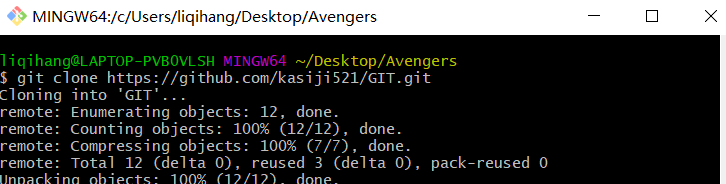
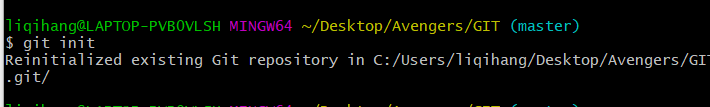
## 用户设置
- 在Git中设置当前使用的用户是谁，且每一次备份都会把当前备份者的信息存储起来
- 命令：
    + 配置用户名：`'git config --global user.name "xiaoming"`
    + 配置邮箱：`git config --global user.email "xm@sina.com"`
    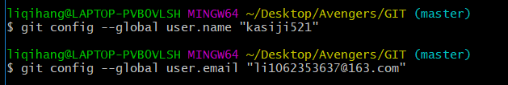
## 使用步骤：
- 1.把代码放进版本库
    + `git add ./文件名` 将指定文件放进版本库
    + `git add ./` 把所有的修改的文件放进版本库
    + `git commit -m "说明"` 这是对这次添加的东西的说明
    + `git commit --all -m "说明"` --all表示将所有修改过的文件提交到版
    本库
    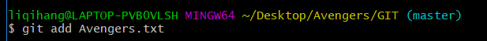
    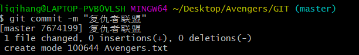
## 查看当前状态
- 可以用来查看当前代码有没有被放进版本库。
- 命令：`git status`
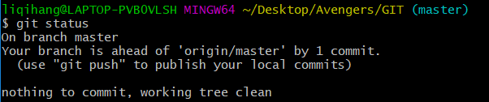
## git中的忽略文件
- - .gitignore,在这个文件中可以设置要被忽略的文件或者目录。
- 被忽略的文件不会被提交仓储里去.
- 在.gitignore中可以书写要被忽略的文件的路径，以/开头，
    一行写一个路径，这些路径所对应的文件都会被忽略，
    不会被提交到仓储中
    + 写法
        * ` /.idea  ` 会忽略.idea文件
        * ` /js`      会忽略js目录里的所有文件
        * ` /js/*.js` 会忽略js目录下所有js文件
## 查看日志
- `git log` 查看历史提交日志
- `git log --oneline` 简介日志
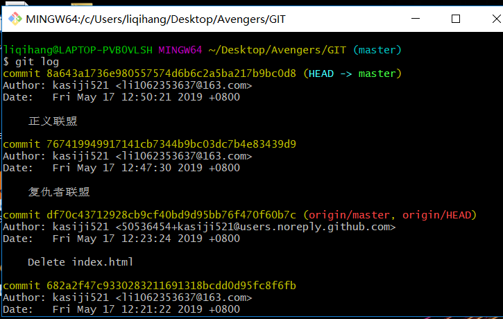
## 回退到指定版本
- `git reset --hard Head~0` 回退到上一次代码提交时的状态
- `git reset --hard Head~1` 回退到上上次代码提交时的状态
- `git reset --hard [版本号]`通过版本号精确的回退到某一次提交时的状态
- `git reflog`可以看到每一次切换版本的记录:可以看到所有提交的版本号
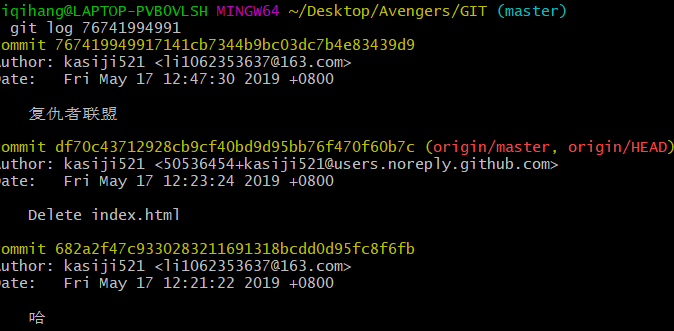
## 管理分支
- 分支
    + 默认有一个主分支master
- 1.创建分支
    + `git branch "分支名称"`创建一个分支,在刚创建时分支里的东西和master分支里的东西是一样的
- 2.切换分支
    + `git checkout "分支名称"`切换到指定的分支,这里的切换到名为的分支
    + `git branch` 可以查看当前有哪些分支
- 3.合并分支
    + `git merge "分支名称"`合并分支内容,把当前分支与指定的分支进行合并。当前分支指的是`git branch`命令输出的前面有*号的分支。合并时如果有冲突，需要手动去处理，处理后还需要再提交一次.
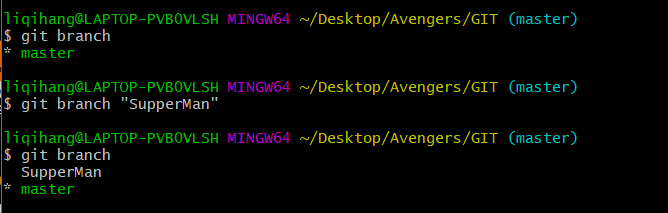
## GitHub
- 地址
    + https://github.com GitHub网址，提供了允许别通过git上传代码的功能
## 提交代码到github
- `git push [地址] master`
    + 示例: `git push https://github.com/huoqishi/test112.git master  master`
    + 会把当前分支的内容上传到远程的master分支上

- `git pull [地址] master`
    + 示例: `git pull https://github.com/huoqishi/test112.git master`
     + 会把远程分支的数据得到:(*注意本地-要初始一个仓储!*)
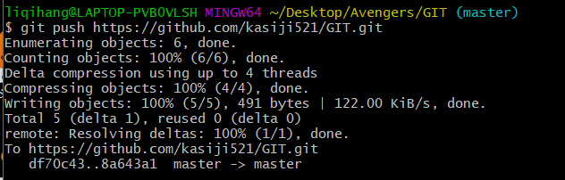
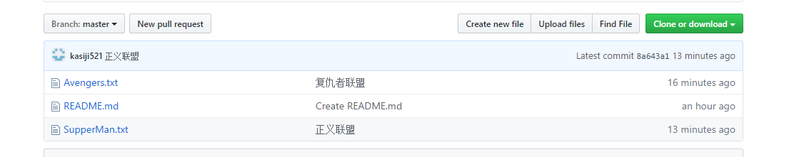
- `git clone [地址]`
    + 会得到远程仓储相同的数据,如果多次执行会覆盖本地内容。
 ## ssh方式上传代码
- 公钥 私钥,两者之间是有关联的。
- 生成公钥,和私钥
    + `ssh-keygen -t rsa -C "xiaoming@sina.com"`
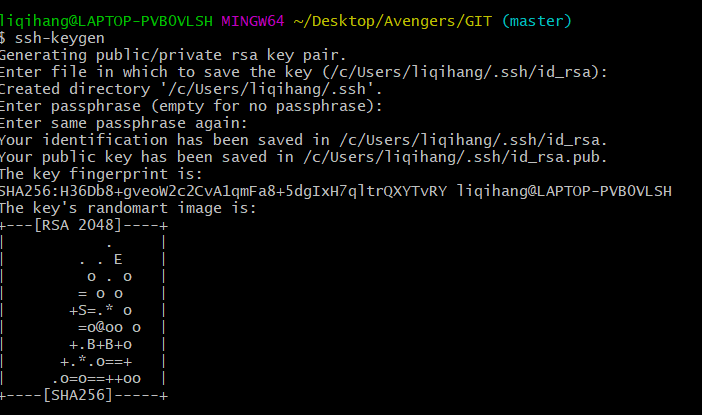
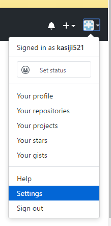
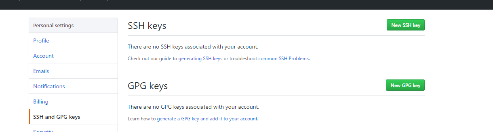
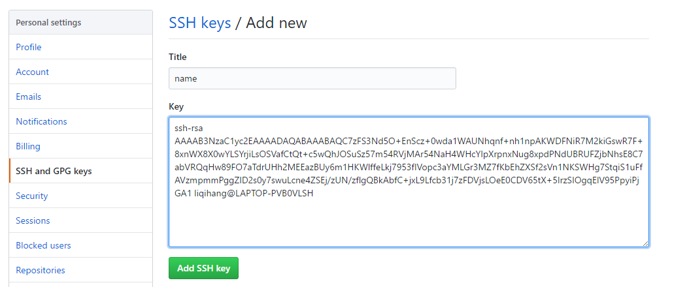
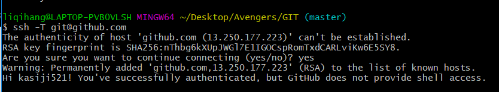
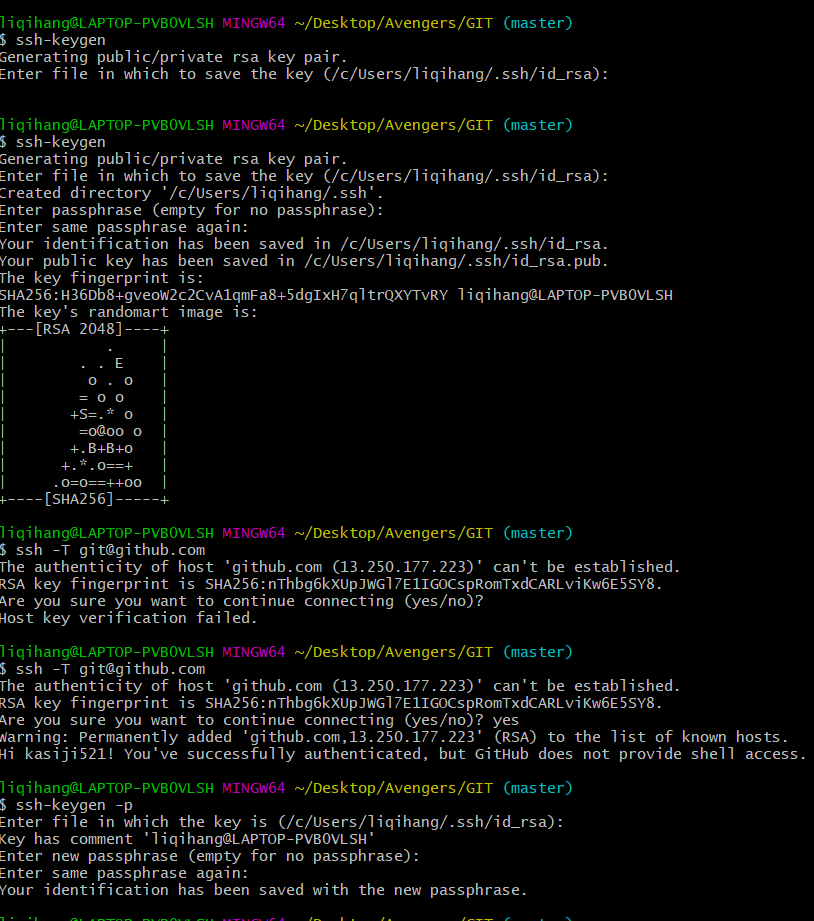
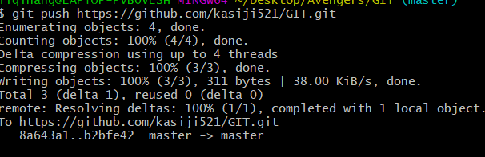
## 在push和pull操作
- 先pull , 再push
- 当我们在push时，加上-u参数，那么在下一次push时
  我们只需要写上`git push`就能上传我们的代码。(加上-u之后，git会把
  当前分支与远程的指定的分支进行关联。git push origin master)